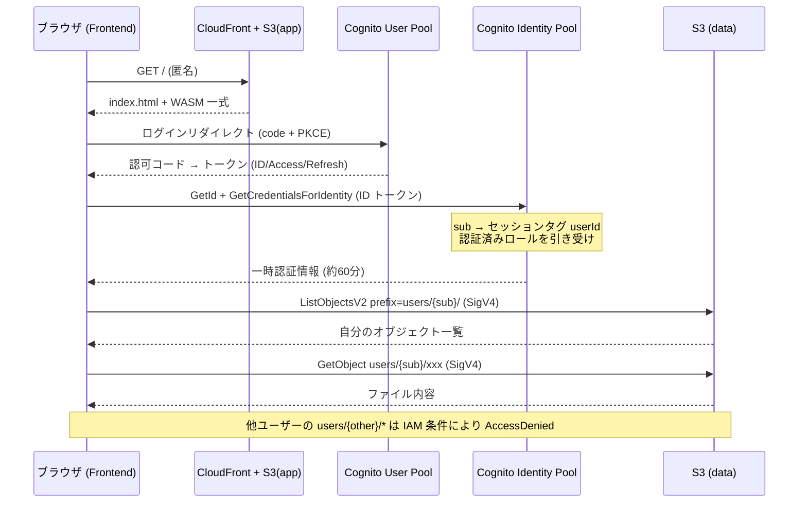

# template-aws-s3-wasm

AWS S3 静的ホスティングで動作する Blazor WebAssembly アプリケーションのテンプレート。
Cognito で認証し、**S3 上の「そのユーザー自身のデータファイル」だけ**を参照できる。認証付きの Lambda API も同梱している。

本書 1 つでゼロから構築・運用・拡張できるようにしてある。

---

## 📖 概要

### できること

- Cognito Managed Login でサインインし、S3 上の `users/{sub}/` 配下のファイルだけを一覧・表示できる
- CSV は集計値・グラフ・明細テーブルとして描画される
- API Gateway + Lambda の認証付き API を呼び出せる（未認証は 401 で遮断）
- インフラ一式が CDK (C#) で再現でき、数コマンドでデプロイ・削除できる

### 前提と割り切り

| 項目 | 方針 |
|---|---|
| データの書き込み | **参照のみ**。S3 へのデータ配置は別システムが行う前提（検証用のシードスクリプトのみ同梱） |
| ユーザー登録 | セルフサインアップ無効。**管理者発行のみ** |
| UI | テンプレートとしての最小限。業務機能は含まない |
| リージョン | `ap-northeast-1` 固定（変更は `IaC/EnvironmentConfig.cs` と `scripts/common.ps1`） |

### この構成が向かない条件

ユーザーごとの小〜中規模ファイルを本人だけが読む、という前提で成立している。次に当たる場合は API 層へ処理を寄せる設計に変える。

- 1 ユーザーあたりのデータ量がブラウザに載せられない規模になる
- 複数ユーザーを横断した集計・検索が必要になる
- データの結合・加工をサーバー側で行う必要がある

---

## 🏗️ アーキテクチャ

```mermaid
graph LR
    subgraph Browser["ブラウザ (Blazor WASM)"]
        App[Frontend]
    end

    subgraph AWS
        CF[CloudFront<br/>OAC + セキュリティヘッダー<br/>SPA フォールバック]
        AppBucket[(S3: アプリバケット<br/>非公開)]
        UP[Cognito User Pool<br/>Managed Login<br/>認証: OIDC code+PKCE]
        IP[Cognito Identity Pool<br/>認可: 一時 AWS 認証情報<br/>+ Principal Tag]
        DataBucket[(S3: データバケット<br/>users/&#123;sub&#125;/...<br/>非公開 + CORS)]
        APIGW[API Gateway HTTP API<br/>Cognito JWT オーソライザー]
        Fn[Lambda<br/>検証済みクレームを参照]
    end

    App -- "① アプリ配信 (匿名)" --> CF
    CF --> AppBucket
    App -- "② ログイン (リダイレクト)" --> UP
    App -- "③ ID トークン → 一時認証情報" --> IP
    App -- "④ SigV4 署名付き GET/List<br/>(本人プレフィックスのみ IAM 許可)" --> DataBucket
    App -- "⑤ アクセストークン (Bearer)" --> APIGW
    APIGW -- "検証済みクレーム付きイベント" --> Fn
```



④ と ⑤ は**認可の方式が異なる 2 本のレーン**。どちらも同じ Cognito サインインから出発するが、権限を評価する主体が違う（S3 は IAM ポリシー、API は API Gateway による JWT 検証）。

### AWS リソース

| リソース | 用途 | 要点 |
|---|---|---|
| S3 アプリバケット | Blazor publish 出力の配信元 | パブリックアクセス全ブロック。CloudFront OAC からのみ読み取り可 |
| CloudFront | アプリ配信 | OAC / HTTPS 強制 / 403・404 → `/index.html` (200) の SPA フォールバック / セキュリティヘッダー付与 / PriceClass 200 |
| S3 データバケット | ユーザー毎データ | パブリックアクセス全ブロック。CORS はアプリオリジンのみ。アクセスは SigV4 署名付きの直接リクエスト |
| Cognito User Pool | 認証 | Managed Login、code + PKCE、シークレットなし、セルフサインアップ無効 |
| Cognito Identity Pool | 認可（AWS 認証情報の払い出し） | 認証済みのみ。Principal Tag で `sub` をセッションタグへマッピング |
| IAM ロール（認証済み） | S3 データアクセス | `users/${aws:PrincipalTag/userId}/*` に限定 |
| API Gateway (HTTP API) | 認証付き API の入口 | JWT オーソライザーを API 既定に設定 |
| Lambda × 2 | API の処理本体（ダミー） | マネージド `dotnet10` ランタイム |

### 主要な設計判断

1. **データ参照に API サーバーを挟まない** — 「読み取り専用 + クライアント内処理」で成立する規模を前提とし、認可のみ IAM に委ねる
2. **データバケットは CloudFront を経由させない** — ユーザー毎の認可は SigV4 署名（= IAM 評価）で行う。CloudFront 経由で per-user 制御をするには Lambda@Edge での JWT 検証が要り、複雑さに見合わない
3. **アプリバケットとデータバケットを分離** — 公開ポリシー・CORS・キャッシュ・ライフサイクルの要件が異なる。単一バケット + プレフィックス分けは事故りやすい
4. **アプリ本体（WASM バンドル）は秘匿しない** — 配信自体は匿名で可能（一般的な SPA と同じ）。守る対象はデータのみ
5. **IaC は AWS CDK (C#)** — リポジトリを C# で統一でき、型付きで設定漏れに強い。Terraform でも実現可能だが .NET テンプレートとしての一体感が下がる
6. **API のルーティングは CDK 側に置く** — Lambda Annotations の `[HttpApi]` や SAM を使うとインフラ記述が 2 箇所に割れる

---

## 🔐 認証と認可

### 認証（Cognito User Pool）

- **フロー**: Authorization Code + PKCE。パブリッククライアント（シークレットなし）
- **UI**: Cognito Managed Login へリダイレクト。独自ログイン画面は作らない
- **Authority**: `https://cognito-idp.{region}.amazonaws.com/{userPoolId}`（OIDC ディスカバリー対応）
- **コールバック**: `authentication/login-callback`（`RemoteAuthenticatorView` の既定パス）
- **トークン有効期限**: ID / アクセス 60 分、リフレッシュ 30 日（Cognito 既定）
- **ログアウト**: 自前実装（理由は[実装上の落とし穴](#-実装上の落とし穴)）

### S3 の認可（Identity Pool + IAM）

**Principal Tag（属性ベースアクセス制御）を採用**している。

| 方式 | 判定 |
|---|---|
| **Principal Tag** — ID トークンの `sub` をセッションタグ `userId` にマッピングし、IAM で `${aws:PrincipalTag/userId}` を使う | **採用**。S3 のキーを User Pool の sub で切れるため、データを配置する側が sub だけ知っていればよい |
| IdentityId 変数 — `${cognito-identity.amazonaws.com:sub}` でプレフィックスを切る古典パターン | 不採用。IdentityId は初回ログインまで確定せず、Identity Pool を作り直すと変わる。データ配置側との突合ができない |

- Identity Pool は認証済み ID のみ許可（ゲストアクセス無効）
- 認証済みロールの信頼ポリシーには `sts:AssumeRoleWithWebIdentity` に加えて **`sts:TagSession`** が必要（セッションタグ伝播の前提条件）

**データレイアウト**

```
s3://{data-bucket}/
  users/
    {userPoolSub}/          ← User Pool の sub (UUID)
      profile.json
      reports/2026-07.csv
```

**認証済みロールの IAM ポリシー**

```json
{
  "Version": "2012-10-17",
  "Statement": [
    {
      "Sid": "ListOwnPrefix",
      "Effect": "Allow",
      "Action": "s3:ListBucket",
      "Resource": "arn:aws:s3:::{data-bucket}",
      "Condition": {
        "StringLike": { "s3:prefix": ["users/${aws:PrincipalTag/userId}/*"] }
      }
    },
    {
      "Sid": "GetOwnObjects",
      "Effect": "Allow",
      "Action": "s3:GetObject",
      "Resource": "arn:aws:s3:::{data-bucket}/users/${aws:PrincipalTag/userId}/*"
    }
  ]
}
```

### API の認可（API Gateway JWT オーソライザー）

S3 と異なり、API は**トークンベース**で認可する。`Authorization: Bearer {アクセストークン}` を送り、API Gateway が署名・発行者・オーディエンスを検証する。

- **オーソライザーは API の既定に設定**する。ルート単位で付け忘れる余地をなくすため
- **Lambda 側に認可ロジックを置かない**。届いた時点で検証済み、という前提が重要で、二重に判定を書くと前提が曖昧になる
- Lambda はイベントの `RequestContext.Authorizer.Jwt.Claims` からクレームを読む。**クライアント申告値ではない**ため、`sub` で処理をユーザー単位に絞れる

**Lambda 直接 Invoke を採らない理由**: Identity Pool の一時認証情報で Lambda を直接呼ぶ案（S3 と同じ IAM 認可）はインフラ追加が最小だが、**Lambda 側で呼び出し元ユーザーを検証できない**（ペイロードの sub はクライアント申告値）。per-user なサーバー処理へ発展させられない。

**トークン種別の注意**: API Gateway はオーディエンスを `aud` **または** `client_id` で照合するため、**ID トークンを送っても検証は通る**（実測確認済み）。種別で拒否したい場合は Lambda 側で `token_use` クレームを確認する。

### シーケンス



---

## 🚀 セットアップ（初回構築）

### 必要なもの

- .NET SDK 10.0+
- Node.js 20+（CDK CLI 実行用）
- AWS CLI v2（認証情報設定済み）

### 事前設定

`IaC/cdk.json` の `context.dev.domainPrefix` を**一意な値**へ変更する。Cognito Managed Login のドメイン名になるため、全 AWS アカウント間で一意である必要がある。

> ⚠️ 小文字英数字とハイフンのみ。予約語 `aws` / `amazon` / `cognito` を**含められない**（含めるとデプロイ時に `InvalidRequest` で失敗する）。リポジトリ名をそのまま使うと引っかかることがある。

### 構築手順

```powershell
# 1. Lambda の成果物を用意（CDK がアセットとして取り込む）
./scripts/deploy-api.ps1

# 2. インフラをデプロイ
cd IaC
npx --yes aws-cdk@latest bootstrap        # アカウント×リージョンで初回のみ
npx --yes aws-cdk@latest deploy -c env=dev --outputs-file ../cdk-outputs.dev.json
cd ..

# 3. ローカル開発用の設定へ反映
./scripts/update-appsettings.ps1 -Env dev

# 4. テストユーザー + サンプルデータ投入
./scripts/seed-user.ps1 -Env dev -Email user1@example.com

# 5. アプリをビルドして配信
./scripts/deploy-app.ps1 -Env dev
```

完了時に表示される URL へアクセスし、`seed-user.ps1` が出力した Email / Password でログインする。

### 動作確認の観点

- 未ログインで `/files` へアクセス → ログインへリダイレクトされる
- ログイン後、自分のデータファイルの一覧・集計値・グラフ・明細テーブルが表示される
- 一覧の「open raw」（S3 直リンク）は、**ログイン中でも**ブラウザで開くと `AccessDenied` になる
- ユーザーを 2 人作成し、他ユーザーのキーを指定した取得が AccessDenied になる
- 「API」ページの 2 つの呼び出しが成功し、返る `sub` が自分のものになる
- `/hello` を連続で叩くと `invocation` が増える（同じ実行環境が再利用されている）
- **トークンなしで API を叩くと 401 になり、Lambda が起動しない**
  （`curl https://{ApiEndpoint}/hello` → 401。CloudWatch Logs に呼び出し記録が増えないこと）
- ディープリンクの直接アクセス・リロードが動作する（SPA フォールバック）

---

## 🔄 更新時のデプロイ

変更した箇所によって実行するものが変わる。

| 変更した箇所 | 実行するもの |
|---|---|
| **Frontend のみ** | `./scripts/deploy-app.ps1 -Env dev` |
| **Backend（Lambda）** | `./scripts/deploy-api.ps1` → `cd IaC; npx --yes aws-cdk@latest deploy -c env=dev --outputs-file ../cdk-outputs.dev.json` |
| **IaC** | 同上（Backend を変えていなければ `deploy-api.ps1` は不要） |
| **IaC を変えて出力値が変わった** | 上記の後に `./scripts/update-appsettings.ps1 -Env dev` と `deploy-app.ps1` |

`deploy-app.ps1` は publish 前に `appsettings.Production.json` を cdk outputs から自動生成する（配信された WASM アプリは常に Production 環境として動作するため）。生成物は gitignore 対象。

### prod 環境

`-c env=prod` でデプロイする。dev との違いは次のとおり。

- バケットと User Pool が **RETAIN + 削除保護**になる（誤削除でデータが消えない）
- localhost のコールバック URL / CORS 許可が**付かない**
- ログ保持期間が 1 か月になる

---

## 🧹 削除（片付け）

```powershell
cd IaC
npx --yes aws-cdk@latest destroy -c env=dev
```

**dev 環境**はバケットの自動削除（`autoDeleteObjects`）と LogGroup の削除込みで、残骸なく消える。

**prod 環境**はバケット・User Pool が RETAIN + 削除保護のため、スタック削除後にそれらを手動で削除する必要がある。データ保全を優先した意図的な設計。

---

## 📁 プログラム構成

```
template-aws-s3-wasm/
├── .editorconfig / Analyzers.ruleset / Directory.Build.props / Directory.Build.targets
├── AGENTS.md / CLAUDE.md                    ← コーディング規約（CLAUDE.md は @AGENTS.md 参照）
├── Template.slnx                            ← ソリューション (Backend + Frontend + IaC)
│
├── Backend/                                 ← Lambda (net10.0, マネージド dotnet10 ランタイム)
│   ├── Startup.cs                           ← [LambdaStartup]。DI コンテナへの登録
│   ├── Functions/
│   │   ├── HelloFunction.cs                 ← GET /hello。検証済みクレームを返す
│   │   └── EchoFunction.cs                  ← POST /echo。JSON ボディを受け取る
│   ├── Services/InvocationCounter.cs        ← ウォームスタート間で生き残る Singleton
│   ├── Application/                         ← Claims（クレーム抽出）/ Json（レスポンス生成）
│   ├── Models/                              ← HelloResponse / EchoModels
│   ├── FunctionSerializerContext.cs         ← 全関数で共有（LambdaSerializer はアセンブリ単位）
│   ├── Assembly.cs                          ← CLSCompliant + LambdaSerializer 属性
│   └── GlobalUsing.cs / GlobalSuppressions.cs
│
├── Frontend/                                ← Blazor WebAssembly (net10.0)
│   ├── Program.cs                           ← DI 構成
│   ├── Assembly.cs / GlobalUsing.cs / GlobalSuppressions.cs / Log.cs
│   ├── Application/
│   │   ├── BrowserHttpClientFactory.cs      ← AWS SDK を browser-wasm で動かすための HTTP 差し替え
│   │   ├── SeriesParser.cs                  ← CSV → DataSeries のパース
│   │   └── ViewHelper.cs                    ← 表示ヘルパー（@using static でマークアップから使用）
│   ├── Auth/
│   │   ├── OidcTokenAccessor.cs             ← sessionStorage から ID トークン読み出し
│   │   ├── AwsCredentialsProvider.cs        ← ID トークン→一時認証情報の取得とキャッシュ
│   │   └── SignOutService.cs                ← Cognito /logout への自前サインアウト
│   ├── Components/
│   │   ├── App.razor / _Imports.razor / RedirectToLogin.cs
│   │   ├── Chart/SeriesChart.razor(.cs)     ← インライン SVG グラフ
│   │   ├── Layout/MainLayout.razor(.cs)     ← ログイン状態表示 + ログイン/ログアウト
│   │   └── Pages/
│   │       ├── Home.razor                   ← 認証状態とクレーム表示
│   │       ├── Files.razor(.cs)             ← [Authorize] 一覧・集計・グラフ・明細・直リンク
│   │       ├── Api.razor(.cs)               ← [Authorize] 認証付き API の呼び出しと結果表示
│   │       ├── Authentication.razor(.cs)    ← RemoteAuthenticatorView ({action})
│   │       └── NotFound.razor
│   ├── Helpers/MediaHelper.cs               ← 描画可否のメディア判定
│   ├── Models/                              ← UserFile / SeriesPoint / DataSeries / HelloResponse
│   ├── Services/
│   │   ├── UserFileRepository.cs            ← 自分のプレフィックスの List / Get、直リンク生成
│   │   └── ApiClient.cs                     ← 認証付き API の呼び出し
│   ├── Settings/AppSetting.cs               ← appsettings.json の App セクション
│   └── wwwroot/                             ← index.html（スプラッシュ付き）/ appsettings*.json / css
│
├── IaC/                                     ← AWS CDK (C#)。Constructs パッケージとの名前空間衝突を避けフラット構成
│   ├── cdk.json                             ← 環境別 context（domainPrefix / allowLocalhost）
│   ├── Program.cs                           ← App エントリ（-c env=dev|prod）
│   ├── EnvironmentConfig.cs                 ← context の読み取りとリージョン等の定数
│   ├── Infrastructure.cs                    ← スタック本体（CA1711 対応で 'Stack' サフィックスを避けた命名）
│   ├── HostingConstruct.cs                  ← アプリバケット + CloudFront
│   ├── AuthConstruct.cs                     ← User Pool + Client + Domain + Identity Pool + ロール
│   ├── DataConstruct.cs                     ← データバケット + CORS
│   └── ApiConstruct.cs                      ← Lambda + HTTP API + JWT オーソライザー + CORS
│
├── scripts/                                 ← 下記「scripts 一覧」参照
└── README.md                                ← 本書
```

### 主要コンポーネント

**Frontend / Program.cs**

- `AWSConfigs.HttpClientFactory` の差し替えを**他のどの AWS 呼び出しよりも前**に行う
- `AddOidcAuthentication` の設定は appsettings から。`email` スコープのみコード側で追加する（設定ファイルに書くと既定スコープと重複する）
- 起動時のデータ読み込みは行わない（認証前は資格情報が無いため、ページ表示時に取得する）

**Frontend / AwsCredentialsProvider**

- `IAccessTokenProvider.RequestAccessToken()` でセッションの有効性を確保した上で、ID トークンを `OidcTokenAccessor` 経由で取得
- 匿名クライアントで `GetId` → `GetCredentialsForIdentity`。IdentityId はセッションにキャッシュし、ページ読み込みごとの `GetId` を省く
- 認証情報は失効 5 分前まで再利用。取得できない場合は例外ではなく `null` を返し、呼び出し側が再ログインへ誘導する

**Frontend / UserFileRepository**

- `ListAsync(sub)` は継続トークンで全件取得。`ObjectUrl(key)` は画面に出す直リンク（セグメント単位で URL エスケープ）
- `AmazonS3Client` は認証情報が更新されるまで使い回す
- sub はクレームから取得してキー組み立てに使うが、**セキュリティ境界は IAM 側**。クライアントでキーを細工しても他ユーザーのデータには到達できない

**IaC の構築順**

App Client の callback URL とデータバケットの CORS に CloudFront ドメインが必要なため、**Hosting → Data → Auth → Api** の順に構築し、distribution ドメインと User Pool / Client を引き渡す。Identity Pool は認可の仕組みが見えるよう L1 (`Cfn*`) で構築している。

### 設定ファイル（wwwroot/appsettings.json）

```json
{
  "Oidc": {
    "Authority": "https://cognito-idp.ap-northeast-1.amazonaws.com/{userPoolId}",
    "ClientId": "{userPoolClientId}",
    "ResponseType": "code"
  },
  "App": {
    "Region": "ap-northeast-1",
    "UserPoolId": "ap-northeast-1_XXXXXXXX",
    "IdentityPoolId": "ap-northeast-1:xxxxxxxx-...",
    "CognitoDomain": "https://{prefix}.auth.ap-northeast-1.amazoncognito.com",
    "DataBucket": "{data-bucket-name}",
    "ApiEndpoint": "https://{apiId}.execute-api.ap-northeast-1.amazonaws.com"
  }
}
```

> ここに載る値は**すべて公開可能**。パブリッククライアント前提で、認可は IAM と API Gateway が担保する。バケット名の推測に対してもパブリックアクセスブロックで防御している。

---

## 📜 scripts 一覧

すべて PowerShell。リポジトリルートから実行する。

| スクリプト | 用途 | 主な引数 |
|---|---|---|
| `deploy-api.ps1` | Backend を `publish-api/` へ publish する。CDK がアセットとして取り込むため、**`cdk deploy` の前**に実行する | なし |
| `update-appsettings.ps1` | cdk outputs から `appsettings.Development.json` を生成する（ローカル開発用） | `-Env dev\|prod` |
| `seed-user.ps1` | テストユーザーを作成し、`users/{sub}/` へサンプルデータを配置する。実ユーザーの発行手順もこれに準じる | `-Email` (必須) / `-Env` / `-Password` |
| `deploy-app.ps1` | Frontend を publish して S3 へ同期し、CloudFront を無効化する。`appsettings.Production.json` の生成も行う | `-Env dev\|prod` |
| `common.ps1` | 上記から dot-source される共通処理（cdk outputs の読み取り、appsettings 生成）。**直接実行しない** | — |

いずれも `cdk-outputs.{env}.json` をリポジトリルートから読む。`cdk deploy` 時に `--outputs-file` を付け忘れると動かない。

---

## 💻 ローカル開発

### Frontend

```powershell
dotnet run --project Frontend
```

`http://localhost:5250` で **dev スタックの実 Cognito / S3 に接続**する（エミュレーターは使わない）。localhost のコールバック URL と CORS 許可は dev 環境にのみ設定されている。

### Lambda

```bash
dotnet-lambda-test-tool-10.0 --path Backend
```

Web UI が起動し、イベント JSON を与えてブレークポイントデバッグができる。

> ⚠️ 再現されるのは Lambda ランタイムのみで、**API Gateway の JWT オーソライザーは再現されない**。ローカルではクレームがテストイベントに書いた値になるため、任意の `sub` でユーザー別処理を検証できる一方、**401 で遮断されること自体はローカルでは確認できない**。認証の遮断は実環境の curl で確認する。

---

## 🧩 拡張方法

### Lambda 関数を追加する

1. `Backend/Functions/` に `[LambdaFunction]` を付けたクラスを追加
2. 新しい Request / Response 型を `FunctionSerializerContext` に追加（`LambdaSerializer` 属性がアセンブリ単位のため）
3. `IaC/ApiConstruct.cs` の `AddRoute` を 1 行足す

ハンドラー名はソースジェネレーターが決める: `{Assembly}::{Namespace}.{Class}_{Method}_Generated::{Method}`

publish 出力は全関数で 1 つを共有する。そのため関数が増えると各関数のコールドスタートに他関数のコード分も乗る。数個なら誤差だが、規模が大きくなったらプロジェクト分割 + 共通処理の Core ライブラリ化を検討する。

### データを配置する

任意のシステムから `s3://{DataBucket}/users/{sub}/...` へ配置する。`sub` は User Pool のユーザー ID で、`aws cognito-idp admin-get-user` で取得できる。

`date,value,note` ヘッダーの CSV はグラフ + 集計 + 明細テーブルとして描画される。それ以外のテキストは生の内容が表示される（判定は `Frontend/Application/SeriesParser.cs`）。

> ⚠️ `AdminGetUser` を呼ぶとそのユーザーが MAU としてカウントされ課金対象になる。一覧目的なら `ListUsers` を使う。

### ユーザーを発行する

セルフサインアップは無効。`aws cognito-idp admin-create-user` で管理者が発行する（`scripts/seed-user.ps1` と同じ手順）。

### その他の拡張ポイント

| 項目 | 概要 |
|---|---|
| アップロード対応 | IAM に本人プレフィックスの `s3:PutObject` を追加し、データバケットの CORS に PUT を許可する |
| カスタムドメイン | CloudFront + ACM と Cognito カスタムドメインを同一サイト（`app.example.com` / `auth.example.com`）に置く。サイレントトークン更新のサードパーティ Cookie 問題も解消する |
| CI/CD | GitHub Actions + OIDC ロール。PR で `dotnet build` + `cdk synth`、main への push でデプロイ |
| CSP 強化 | `connect-src` の S3 / API Gateway をリージョンワイルドカードから具体名へ（デプロイ後に確定するため書き換えが要る） |
| Cognito | MFA、脅威保護（Plus プラン）、招待メールによるユーザー発行 |
| 監査 | S3 サーバーアクセスログ / CloudTrail データイベント |

---

## ⚡ パフォーマンス設計

初回表示は「ダウンロード → ランタイムブート → 認証状態の解決」の 3 つの待ちで構成される。

> 📌 計測の注意: ネットワーク計測（リソース取得の完了時刻）だけでは後半 2 つの CPU 実行が見えない。実際、当初はネットワーク完了後もページ表示まで通信ゼロの CPU 実行が続いており、そこが体感の支配要因だった。表示フェーズの遷移は DOM のサンプリングで測ること。また非表示タブはブラウザにスロットリングされ、絶対値が大きく出る。

### キャッシュ（2 段構え）

| 対象 | Cache-Control | 理由 |
|---|---|---|
| `_framework/` のフィンガープリント付きアセット | `public, max-age=31536000, immutable` | 内容が変わればファイル名が変わるため、古い実体が新しいマニフェストと組み合わさることが原理的に起きない |
| エントリーポイント（`index.html` / `dotnet.js` / `blazor.webassembly.js` / `appsettings*.json` / `css`） | `no-cache` | 上のファイル名を解決する側。ここが常に最新であることが整合性を担保する |

全ファイルを `no-cache` にすると、アクセスのたびに約 70 ファイル分の条件付き GET が発生し再訪が目に見えて遅くなる。**実測では 71 リクエスト → 8 リクエストに減った。**

### 適用済みの施策

| 施策 | 効果 |
|---|---|
| **AOT コンパイル**（`RunAOTCompilation=true`、publish のみ） | 起動時の C# 実行をネイティブ wasm 化。ペイポードは増える（転送ベース 2.5MB → 5.4MB）が immutable キャッシュにより初回限り。ローカルの `dotnet build` には影響しない |
| **アプリが使用可能になるまでスプラッシュ維持** | index.html と同一のスプラッシュを全画面で描画し、静的スプラッシュ → Blazor 描画 → 最初のページ が 1 つの連続した読み込みに見えるようにする |
| **`preconnect`**（cognito-idp / cognito-identity） | ランタイム取得中に DNS + TCP + TLS を済ませる。実測で認証時の接続確立コストが 0 になった |
| **IdentityId のセッションキャッシュ** | ページ読み込みごとの `GetId` が消え、Cognito Identity への呼び出しが 2 回 → 1 回 |
| **`AmazonS3Client` の再利用** | 呼び出しごとのクライアント構築（エンドポイント解決・署名器の初期化）をやめた |

### デプロイ時の処理

- **publish 前に出力ディレクトリを削除する**。`dotnet publish -o` は出力先を掃除しないため、過去ビルドのフィンガープリント付きアセットが溜まり続ける（実際に S3 のオブジェクトが 300 個まで増えた）
- **`.br` / `.gz` はアップロードしない**。S3 オリジンではコンテンツネゴシエーションが行われず要求されない（実測でリクエスト 0 件）
- **10MB 超のアセットは Brotli 圧縮済みボディを同じキーに配置する**（`Content-Encoding: br`）。CloudFront の動的圧縮は 10MB までのため、AOT 化した `dotnet.native.wasm`（約 19MB）が非圧縮で配信されてしまう。**実測 19MB → 3.98MB**
- `.wasm` / `.js` の Content-Type を明示設定する（環境により `application/octet-stream` と判定され圧縮対象から外れる）

### 見送った施策

- **OIDC ディスカバリーの省略** — API 上できない。`OidcProviderOptions.AdditionalProviderParameters` は `string` 値しか受け付けず、メタデータ文書をインラインで渡せない
- **初回ペイロードの削減** — AWS SDK が大きな割合を占めるが（`AWSSDK.Core` 584KB + `AWSSDK.S3` 199KB + `System.Private.Xml` 371KB、圧縮前）、SigV4 の自前実装や遅延ロードは実装量と保守コストに見合わない

---

## 🛡️ セキュリティ

| 項目 | 方針 |
|---|---|
| トークン保管 | Blazor WASM Authentication 既定（sessionStorage）。XSS 対策として CSP を必須とし、外部スクリプトを読み込まない |
| CSP | `default-src 'self'` を基本に、`connect-src` を Cognito / S3 / API Gateway に限定。`script-src` は `'self' 'wasm-unsafe-eval'`、`frame-ancestors 'none'`。S3 と API のホストはデプロイ後に確定するためリージョン内ワイルドカード |
| S3（両バケット） | パブリックアクセス全ブロック + `aws:SecureTransport` 強制 + SSE-S3 |
| CORS | データバケットのみ。オリジンを CloudFront ドメイン（+ dev は localhost）に限定 |
| IAM | 認証済みロールは 2 ステートメントのみ。ワイルドカード禁止。Identity Pool のゲストアクセス無効 |
| Cognito | セルフサインアップ無効・管理者発行 |
| API | オーソライザーを API 既定に設定し、認可なしルートを作れないようにする。アクセストークンは `AuthorizationMessageHandler` の `authorizedUrls` により **API エンドポイント宛にのみ**付与され、S3 や Cognito へは送られない |
| 秘密情報 | アプリ・リポジトリに秘密情報を置かない |

> ⚠️ **SPA フォールバックの副作用**: 403 → `index.html` (200) 変換により、アプリバケットに対する実際のアクセス拒否もアプリ画面として返る。仕様として許容している。

---

## ⚠️ 実装上の落とし穴

Blazor WASM + AWS の組み合わせで実際に踏んだ問題と対処。**流用時にも同じ制約が効く。**

### AWS SDK は browser-wasm でそのままでは動かない

2 段階の問題があり、いずれも `AWSConfigs.HttpClientFactory` の差し替え（`Frontend/Application/BrowserHttpClientFactory.cs`）で解決している。

1. SDK 既定の HTTP ファクトリが `SocketsHttpHandler` を構成するが、ブラウザでは未対応で `PlatformNotSupportedException` になる。すべての通信は fetch を通す必要があるため `HttpClientHandler` ベースで組む
2. SDK のアンマーシャラーがレスポンスボディを**同期読み**するが、ブラウザのレスポンスストリームは非同期読みしか対応していない（`net_http_synchronous_reads_not_supported`）。`DelegatingHandler` で事前バッファリングし `MemoryStream` として渡す

### Cognito の `/logout` は OIDC 標準ではない

RP-Initiated Logout（`end_session_endpoint`）に対応しておらず、`client_id` + `logout_uri` 方式のみ。認証ライブラリの標準ログアウトフローは使えないため、`SignOutService` で「ローカルセッションと認証情報キャッシュを破棄 → `/logout?client_id=...&logout_uri={アプリURL}` へ遷移」を自前実装している。`logout_uri` はアプリクライアントの Allowed sign-out URLs への登録が必要。

### Cognito ドメインプレフィックスの予約語

`aws` / `amazon` / `cognito` を含めると作成時に `InvalidRequest` で失敗する。リポジトリ名をそのまま使うと該当することがある。

### `RemoteAuthenticatorView` の Action バインド

`Action="Action"` と書くとリテラル文字列 `"action"` が渡り `Invalid action 'action'` で認証画面が動かない。**`Action="@Action"`** と書く必要がある。

### ID トークンの取得はライブラリ内部仕様に依存する

Identity Pool の `GetCredentialsForIdentity` に渡せるのは **ID トークン**だが、`Microsoft.AspNetCore.Components.WebAssembly.Authentication` の C# API はアクセストークンしか公開していない。そのため `OidcTokenAccessor` が、内部の oidc-client-ts が sessionStorage に保存するキー `oidc.user:{authority}:{clientId}` を直接読んでいる。**.NET のメジャーアップデート時はキー形式の互換を再確認すること。**

### Lambda Annotations は `serverless.template` を生成し、抑止できない

`[LambdaFunction]` が 1 つでもあれば無条件に生成される（AWS のジェネレーター実装で条件がそうなっており、MSBuild プロパティ等のオプトアウトは無い。手で削除してもフルビルドで再生成される）。

本構成では未使用なうえ、内容（MemorySize 512 / Timeout 30 / **オーソライザーなし**）が実デプロイと食い違うため、誤って `dotnet lambda deploy-serverless` すると**認証なしの重複関数**ができる罠になる。そのため `Backend.csproj` の `RemoveGeneratedServerlessTemplate` ターゲットでビルド後に削除している（`.gitignore` にも保険として登録）。Lambda パッケージには元から混入しない。

### Lambda Annotations はメソッドを static にできない

`[LambdaStartup]` の `ConfigureServices` もハンドラーメソッドも、生成コードがインスタンス経由で呼ぶため static にできない。DI を使わない関数でも同様で、CA1822 を局所的に抑止している。フレームワークが形を強制するもので回避手段はない。

### Razor では SVG の `<text>` を直接書けない

`<text>` は Razor が制御構文のエスケープ用に予約しているため、属性付きで書くとコンパイルエラーになる。`SeriesChart` では軸ラベルのみ組み立て済みマークアップ（`MarkupString`）として出力している。

### `HttpMethod` の名前衝突（CDK）

`Amazon.CDK.AWS.Apigatewayv2` と `Amazon.CDK.AWS.Lambda` の両方が `HttpMethod` を定義するため、using エイリアスで解決している。

---

## 💰 ランニングコスト

デプロイしたまま置いた場合の月額。ap-northeast-1 / CloudFront は日本向け、2026-08 時点の公開価格（USD・税別）。

| サービス | デモ運用（3 ユーザー・50 PV/月） | 軽い実運用（100 MAU・1,000 PV・5GB 転送） |
|---|---|---|
| S3（アプリ + データ数 KB） | 約 $0.0007 | 約 $0.01 |
| CloudFront | $0（無料枠内） | $0（無料枠内） |
| Cognito User Pool (Essentials) | $0（無料枠内） | $0（無料枠内） |
| Cognito Identity Pool | $0（常に無料） | $0（常に無料） |
| Lambda | $0（常時無料枠内） | $0（常時無料枠内） |
| API Gateway (HTTP API) | $0.00006 | 約 $0.013 |
| CloudFormation / IAM | $0 | $0 |
| **合計** | **実質 $0（1 セント未満）** | **約 $0.02** |

- **無料枠に収まる理由**: CloudFront は月 1TB 転送 + 1,000 万リクエストが恒久無料。Cognito User Pool は Lite / Essentials とも月 10,000 MAU まで恒久無料（Plus は無料枠なし）。Identity Pool は常に無料。Lambda は月 100 万リクエスト + 40 万 GB 秒が恒久無料
- **API Gateway だけは恒久無料枠がない**（100 万コール無料はアカウント作成から 12 か月限定）。ただし HTTP API は $1.29/100 万リクエストで、REST API の $4.25 に対して約 1/3。上表は無料枠を当てにしない前提の額
- **バケットや Distribution の「存在」自体に固定費はかからない**
- **無料枠が全て無くなったと仮定しても**デモ運用で約 $0.09/月、軽い実運用で約 $2.2/月。大半は Cognito の MAU 課金（$0.015/MAU）で、スケール時の主なコスト要因はここ
- `PriceClass 200` は日本を含むため必須（`PriceClass 100` は北米・欧州のみで、日本からは遠いエッジに飛ぶ）
- カスタムドメインを追加すると Route 53 ホストゾーンが約 $0.50/月かかる

---

## 📋 既知の制約

| 項目 | 内容 |
|---|---|
| サイレントトークン更新 | Cognito ドメインがアプリと別サイトのため、サードパーティ Cookie 制限下で iframe 更新が失敗し得る。失敗時は再ログイン誘導で成立させている（60 分セッションを許容）。恒久策はカスタムドメイン |
| API のトークン種別 | オーソライザーはアクセストークンと ID トークンのどちらも通す。種別を限定したい場合は Lambda 側で `token_use` を確認する |
| Lambda のコールドスタート | マネージドランタイムのため初回呼び出しに JIT ウォームアップが乗る（実測 700ms 程度）。詰めるなら Native AOT だが、Windows から Linux 向けにビルドするには実質 Docker が要るため採用していない |
| UI の仮想化 | `ListObjectsV2` は継続トークンで全件取得するが、一覧の仮想化は行っていない。ファイル数が多い用途では要検討 |
| シードの冪等性 | `seed-user.ps1` は配置のみで既存オブジェクトを消さないため、サンプルデータの構成を変えると旧ファイルが残る |
| prod 環境 | dev のみデプロイ・検証済み。`-c env=prod` は未実行 |
| CI/CD | GitHub Actions は未同梱 |

---

## 📄 ライセンス

[LICENSE](LICENSE) を参照。
