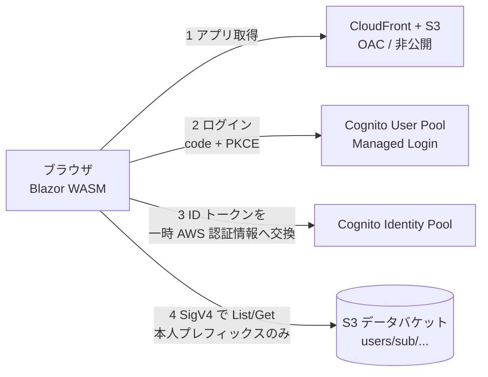

# template-aws-s3-wasm

AWS S3 静的ホスティングで動作する Blazor WebAssembly アプリケーションのテンプレート。
Cognito で認証し、S3 上の「そのユーザー自身のデータファイル」だけを参照できる。バックエンド API を持たない。

設計の詳細と、Blazor WASM + AWS 特有の実装上の制約は [docs/DESIGN.md](docs/DESIGN.md) を参照。

## アーキテクチャ



- 認可の要: Identity Pool が ID トークンの `sub` をセッションタグ `userId` にマッピングし、IAM ポリシーの `${aws:PrincipalTag/userId}` で `users/{sub}/` 配下のみ許可する。アプリ側でキーを細工しても他ユーザーのデータは AccessDenied になる
- S3 はアプリ・データとも非公開。アプリは CloudFront (OAC) 経由で配信、データは CORS + SigV4 署名付きの直接アクセス

## 構成

| パス | 内容 |
|---|---|
| `Frontend/` | Blazor WebAssembly (net10.0)。OIDC 認証、一時認証情報の取得、データファイルの一覧・集計・グラフ表示 |
| `IaC/` | AWS CDK (C#)。CloudFront / S3 / Cognito User Pool / Identity Pool / IAM 一式 |
| `scripts/` | デプロイ・設定反映・テストデータ投入（PowerShell） |
| `docs/DESIGN.md` | 設計ドキュメント（構成の根拠、実装上の制約） |

## 前提

- .NET SDK 10.0+
- Node.js 20+（CDK CLI 実行用）
- AWS CLI v2（認証情報設定済み）
- リージョン: `ap-northeast-1`（変更する場合は `IaC/EnvironmentConfig.cs` と `scripts/common.ps1`）

## 初回セットアップ

まず `IaC/cdk.json` の `context.dev.domainPrefix` を一意な値へ変更する（Cognito Managed Login のドメインで、全 AWS アカウント間で一意である必要がある。例: `myapp-portal-dev`）。
小文字英数字とハイフンのみ使用可能で、予約語 `aws` / `amazon` / `cognito` を含めることはできない（含めるとデプロイ時に InvalidRequest で失敗する）。

```powershell
# 1. インフラをデプロイ
cd IaC
npx --yes aws-cdk@latest bootstrap        # アカウント×リージョンで初回のみ
npx --yes aws-cdk@latest deploy -c env=dev --outputs-file ../cdk-outputs.dev.json
cd ..

# 2. ローカル開発用設定へ反映
./scripts/update-appsettings.ps1 -Env dev

# 3. テストユーザー + サンプルデータ投入
./scripts/seed-user.ps1 -Env dev -Email user1@example.com

# 4. アプリをビルドして配信
./scripts/deploy-app.ps1 -Env dev
```

deploy-app 完了時に表示される URL へアクセスし、seed-user が表示した Email / Password でログインする。

## ローカル開発

```powershell
dotnet run --project Frontend
```

`http://localhost:5250` で dev スタックの実 Cognito / S3 に接続する（エミュレーターは使わない）。
localhost のコールバック URL と CORS 許可は dev 環境にのみ設定される。

## 動作確認の観点

- 未ログインで `/files` へアクセス → ログインへリダイレクトされる
- ログイン後、自分のデータファイルの一覧・集計値・グラフ・明細テーブルが表示される
- 一覧の「open raw」（S3 オブジェクトの直リンク）は、ログイン中でもブラウザで開くと `AccessDenied` になる
  （バケットは公開ブロック済みで、読み取りには SigV4 署名が必要。アプリはその署名を一時認証情報で行っている）
- ユーザーを 2 人作成し、他ユーザーのキーを指定した取得が AccessDenied になる
- ディープリンクの直接アクセス・リロードが動作する（SPA フォールバック）
- トークン失効（60 分放置）後に再ログインへ誘導される
- `cdk destroy` で dev 環境が残骸なく消える

## ランニングコスト

この構成をデプロイしたまま置いた場合の月額。ap-northeast-1 / CloudFront は日本向け、2026-08 時点の公開価格（USD・税別）。

| サービス | デモ運用（3 ユーザー・50 PV/月） | 軽い実運用（100 MAU・1,000 PV・5GB 転送） |
|---|---|---|
| S3（アプリ 7MB + データ数 KB） | 約 $0.0007 | 約 $0.01 |
| CloudFront | $0（無料枠内） | $0（無料枠内） |
| Cognito User Pool (Essentials) | $0（無料枠内） | $0（無料枠内） |
| Cognito Identity Pool | $0（常に無料） | $0（常に無料） |
| CloudFormation / IAM / ECR（空） | $0 | $0 |
| **合計** | **実質 $0（1 セント未満）** | **約 $0.01** |

- **無料枠に収まる理由**: CloudFront は月 1TB 転送 + 1,000 万リクエストが恒久無料。Cognito User Pool は Lite / Essentials とも月 10,000 MAU まで恒久無料（Plus は無料枠なし）。Identity Pool の認証情報払い出しは常に無料
- **バケットや Distribution の「存在」自体に固定費はかからない**。CloudFormation スタック・IAM ロールも `AWS::*` のみなら無料
- **無料枠が全て無くなったと仮定した場合**でもデモ運用で約 $0.09/月、軽い実運用で約 $2.2/月。内訳の大半は Cognito の MAU 課金（$0.015/MAU）で、スケール時の主なコスト要因はここになる
- **注意点**: `PriceClass 200` は日本を含むため必須（`PriceClass 100` は北米・欧州のみで、日本からは遠いエッジに飛ぶ）。カスタムドメインを追加すると Route 53 ホストゾーンが約 $0.50/月かかる。`AdminGetUser` を呼ぶとそのユーザーが MAU としてカウントされるため、一覧目的なら `ListUsers` を使う

## 運用

- **ユーザー発行**: セルフサインアップは無効。`aws cognito-idp admin-create-user`（`scripts/seed-user.ps1` と同じ手順）で管理者が発行する
- **データ配置**: 任意のシステムから `s3://{DataBucket}/users/{sub}/...` へ配置する（`sub` は User Pool のユーザー ID。`admin-get-user` で取得できる）
- **データ形式**: `date,value,note` ヘッダーの CSV はグラフ + 集計 + 明細テーブルとして描画される。それ以外のテキストは生の内容を表示する（判定は `Frontend/Application/SeriesParser.cs`）
- **アプリは参照のみ**: IAM に書き込み権限はない
- **prod 環境**: `-c env=prod` でデプロイ。バケットと User Pool は RETAIN + 削除保護になり、localhost 許可も付かない

## 片付け

```powershell
cd IaC
npx --yes aws-cdk@latest destroy -c env=dev
```

dev 環境はバケットの自動削除（autoDeleteObjects）込みで残骸なく消える。prod は保全のため手動削除が必要。

## 拡張ポイント

- **カスタムドメイン**: CloudFront + ACM と Cognito カスタムドメインを同一サイト（例: `app.example.com` / `auth.example.com`）に置くと、サイレントトークン更新のサードパーティ Cookie 問題も解消する
- **起動時間**: AOT・キャッシュ・圧縮は適用済み（[docs/DESIGN.md](docs/DESIGN.md) §6.1–6.2）。さらに縮めるなら AWS SDK を使わず SigV4 を自前実装してペイロードを削る余地がある
- **CSP 強化**: `connect-src` の S3 をリージョンワイルドカードからデプロイ後のバケット名直書きへ（`IaC/HostingConstruct.cs`）
- **アップロード対応**: IAM に本人プレフィックスの `s3:PutObject` を追加し、CORS に PUT を許可
- **CI/CD**: GitHub Actions + OIDC ロールによる自動デプロイ
- **Cognito**: MFA、脅威保護（Plus プラン）、招待メールによるユーザー発行

## 留意事項

- `appsettings.json` に載る ID 類（User Pool / Client / Identity Pool / バケット名）は秘密情報ではない。認可は IAM が担う
- SPA フォールバックの仕様上、配信バケットに対する実際のアクセス拒否 (403) も `index.html` (200) として返る
- トークンのサイレント更新はブラウザのサードパーティ Cookie 制限で失敗することがある。その場合は再ログイン誘導になる（セッション 60 分）

## ライセンス

[LICENSE](LICENSE) を参照。
