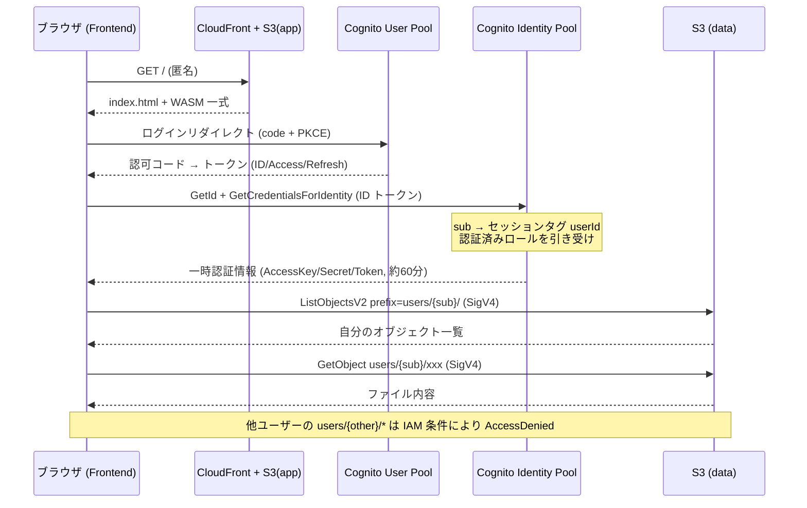

# 設計ドキュメント

S3 静的ホスティングで動作する Blazor WebAssembly アプリケーションのテンプレート。
Cognito で認証し、S3 上の「そのユーザー自身のデータファイルのみ」を参照できる構成を、アプリ本体 + IaC + 運用スクリプトのセットで提供する。

セットアップ手順・コマンド・ランニングコストは [README](../README.md) を参照。本書は「なぜその構成なのか」を記録する。

---

## 1. 目的とスコープ

### 1.1 目的

- GitHub テンプレートとして再利用可能な「認証付き S3 ホスト WASM アプリ」の最小構成を示す
- サーバーサイド API を持たず、静的配信 + クライアントからの直接アクセスで完結させる
- インフラを IaC で再現可能にし、テンプレート利用者が一連のコマンドでデプロイできるようにする

### 1.2 スコープ

| 区分 | 内容 |
|---|---|
| 対象 | Blazor WASM アプリ（ログイン / ログアウト、自分のデータファイルの一覧・集計・グラフ表示） |
| 対象 | IaC（CloudFront + S3 + Cognito User Pool / Identity Pool + IAM）一式 |
| 対象 | デプロイスクリプト、テストユーザー・サンプルデータ投入スクリプト |
| 対象 | S3 直リンクを画面に出し、アクセス制御が効いていることを目視確認できるようにする |
| 対象外 | 業務機能・作り込んだ UI（テンプレートとしての最小限に留める） |
| 対象外 | データの書き込み・アップロード（参照のみ） |
| 対象外 | データを S3 へ配置する側の仕組み（別システムが書き込む前提。検証用シードのみ用意） |
| 対象外 | カスタムドメイン / Route 53 / ACM（README に拡張ポイントとして記載） |
| 対象外 | CI/CD（GitHub Actions は未同梱） |

### 1.3 この構成が向かない条件

ユーザーごとの小〜中規模ファイルを本人だけが読む、という前提で成立している。次のいずれかに当たる場合は API 層の導入を検討する。

- 1 ユーザーあたりのデータ量がブラウザに載せられない規模になる
- 複数ユーザーを横断した集計・検索が必要になる
- データの結合・加工をサーバー側で行う必要がある

---

## 2. アーキテクチャ

### 2.1 構成図

```mermaid
graph LR
    subgraph Browser["ブラウザ (Blazor WASM)"]
        App[Frontend]
    end

    subgraph AWS
        CF[CloudFront<br/>OAC + セキュリティヘッダー<br/>SPA フォールバック]
        AppBucket[(S3: アプリバケット<br/>publish/wwwroot<br/>非公開)]
        UP[Cognito User Pool<br/>Managed Login<br/>認証: OIDC code+PKCE]
        IP[Cognito Identity Pool<br/>認可: 一時 AWS 認証情報<br/>+ Principal Tag]
        DataBucket[(S3: データバケット<br/>users/&#123;sub&#125;/...<br/>非公開 + CORS)]
        APIGW[API Gateway HTTP API<br/>Cognito JWT オーソライザー]
        Fn[Lambda<br/>検証済みクレームを参照]
    end

    App -- "① アプリ配信 (匿名)" --> CF
    CF --> AppBucket
    App -- "② ログイン (リダイレクト)" --> UP
    App -- "③ ID トークン → 一時認証情報" --> IP
    App -- "④ SigV4 署名付き GET/List<br/>(本人プレフィックスのみ IAM 許可)" --> DataBucket
    App -- "⑤ アクセストークン (Bearer)" --> APIGW
    APIGW -- "検証済みクレーム付きイベント" --> Fn
```



④ と ⑤ は**認可の方式が異なる 2 本のレーン**である。どちらも同じ Cognito サインインから出発するが、権限を評価する主体が違う（S3 は IAM ポリシー、API は API Gateway による JWT 検証）。

### 2.2 AWS リソース一覧

| リソース | 用途 | 要点 |
|---|---|---|
| S3 アプリバケット | Blazor publish 出力の配信元 | パブリックアクセス全ブロック。CloudFront OAC からのみ読み取り可 |
| CloudFront | アプリ配信 | OAC、HTTPS 強制、403/404 → `/index.html` (200) の SPA フォールバック、ResponseHeadersPolicy でセキュリティヘッダー付与 |
| S3 データバケット | ユーザー毎データ (`users/{sub}/...`) | パブリックアクセス全ブロック。CORS でアプリオリジンからの GET/HEAD のみ許可。アクセスは SigV4 署名付きの直接リクエスト |
| Cognito User Pool | 認証（ID 管理） | Managed Login ドメイン、アプリクライアント（シークレットなし、code + PKCE）。セルフサインアップ無効（管理者発行） |
| Cognito Identity Pool | 認可（AWS 認証情報の払い出し） | 認証済みユーザーのみ。Principal Tag で `sub` クレームをセッションタグへマッピング |
| IAM ロール（認証済み） | S3 データアクセス権限 | `users/${aws:PrincipalTag/userId}/*` に限定した GetObject / ListBucket |
| API Gateway (HTTP API) | 認証付き API の入口 | Cognito JWT オーソライザーを API 既定に設定。CORS はアプリオリジンのみ |
| Lambda | API の処理本体（ダミー） | マネージド `dotnet10` ランタイム。検証済みクレームを参照するだけで、認可判定は持たない |

### 2.3 主要な設計判断

1. **API サーバーを挟まない**
   「読み取り専用 + クライアント内処理」で成立する規模を前提とし、認可のみ IAM に委ねる。Lambda / API Gateway を足すとテンプレートの主旨（S3 ホスト完結）から外れる。
2. **データバケットは CloudFront を経由させない**
   ユーザー毎の認可は SigV4 署名（= IAM 評価）で行うため、S3 リージョナルエンドポイントへ直接アクセスする。CloudFront 経由で per-user 制御を行うには Lambda@Edge 等での JWT 検証が必要になり、複雑さに見合わない。
3. **アプリバケットとデータバケットを分離**
   公開ポリシー・CORS・キャッシュ・ライフサイクルの要件が異なる。単一バケット + プレフィックス分けは事故りやすいため採用しない。
4. **アプリ本体（WASM バンドル）は秘匿しない**
   配信自体は匿名で可能とする（一般的な SPA と同じ）。守る対象はデータのみ。アプリ自体の秘匿が必要な場合は Lambda@Edge / CloudFront Functions + JWT 検証が拡張ポイントになる。
5. **IaC は AWS CDK (C#)**
   リポジトリ全体を C#/.NET で統一でき、テンプレート利用者の学習対象を増やさない。型付きのため Cognito / CloudFront の設定漏れにも強い。Node.js（cdk CLI）が前提になる点のみ注意。Terraform でも実現可能だが、.NET テンプレートとしての一体感が下がるため採用していない。

---

## 3. 認証・認可

### 3.1 認証（Cognito User Pool）

- **フロー**: Authorization Code + PKCE。アプリクライアントはパブリッククライアント（シークレットなし）
- **UI**: Cognito Managed Login へリダイレクトする。独自ログイン画面は作らない
- **Blazor 側**: `Microsoft.AspNetCore.Components.WebAssembly.Authentication` の標準 OIDC サポートを使用
  - Authority: `https://cognito-idp.{region}.amazonaws.com/{userPoolId}`（OIDC ディスカバリー対応）
  - コールバック: `authentication/login-callback`（`RemoteAuthenticatorView` の既定パス）
  - スコープ: `openid email profile`
- **サインアップ**: セルフサインアップ無効。ユーザーごとのデータを別系統で配置する前提のため、ユーザーは管理者発行（`admin-create-user`）とする
- **ログアウト**: 自前実装（理由は §8.2）
- **トークン有効期限**: ID / アクセス 60 分、リフレッシュ 30 日（Cognito 既定）

### 3.2 認可（Cognito Identity Pool + IAM）

**方式: Principal Tag（属性ベースアクセス制御）**

| 方式 | 内容 | 判定 |
|---|---|---|
| A. Principal Tag | ID トークンの `sub`（User Pool の sub）をセッションタグ `userId` にマッピングし、IAM ポリシーで `${aws:PrincipalTag/userId}` を使用 | **採用**。S3 のキーを User Pool の sub で切れるため、データを配置する側が sub だけ知っていればよい |
| B. IdentityId 変数 | `${cognito-identity.amazonaws.com:sub}`（= Identity Pool の IdentityId）でプレフィックスを切る古典パターン | 不採用。IdentityId は初回ログインまで確定せず、Identity Pool を作り直すと変わる。データを配置する側との突合ができない |

- Identity Pool は認証済み ID のみ許可（ゲストアクセス無効）
- 認証プロバイダーは当該 User Pool アプリクライアントのみ
- 拡張フロー（`GetId` → `GetCredentialsForIdentity`）を使用。ID トークンを `Logins` に渡すと約 60 分有効の一時認証情報が返る
- 認証済みロールの信頼ポリシーには `sts:AssumeRoleWithWebIdentity` に加えて **`sts:TagSession`** が必要（セッションタグ伝播の前提条件）

**S3 データレイアウト**

```
s3://{data-bucket}/
  users/
    {userPoolSub}/          ← User Pool の sub (UUID)
      profile.json
      reports/2026-07.csv
      ...
```

**認証済みロールの IAM ポリシー**

```json
{
  "Version": "2012-10-17",
  "Statement": [
    {
      "Sid": "ListOwnPrefix",
      "Effect": "Allow",
      "Action": "s3:ListBucket",
      "Resource": "arn:aws:s3:::{data-bucket}",
      "Condition": {
        "StringLike": {
          "s3:prefix": ["users/${aws:PrincipalTag/userId}/*"]
        }
      }
    },
    {
      "Sid": "GetOwnObjects",
      "Effect": "Allow",
      "Action": "s3:GetObject",
      "Resource": "arn:aws:s3:::{data-bucket}/users/${aws:PrincipalTag/userId}/*"
    }
  ]
}
```

### 3.3 API の認可（API Gateway JWT オーソライザー）

S3 と異なり、API は**トークンベース**で認可する。Frontend が `Authorization: Bearer {アクセストークン}` を送り、API Gateway が署名・発行者・オーディエンスを検証する。

- **オーソライザーは API の既定に設定**する。ルート単位で付け忘れる余地をなくすため。合成結果のルートに `AuthorizationType: JWT` が入ることで担保される
- **Lambda 側に認可ロジックを置かない**。届いた時点で検証済み、という前提が成立していることが重要で、二重に判定を書くとその前提が曖昧になる
- Lambda はイベントの `RequestContext.Authorizer.Jwt.Claims` からクレームを読む。**クライアントが申告した値ではない**ため、`sub` で処理をユーザー単位に絞ることができる

**方式選定の理由**: Identity Pool の一時認証情報で Lambda を直接 Invoke する案（S3 と同じ IAM 認可）はインフラ追加が最小だが、**Lambda 側で呼び出し元ユーザーを検証できない**（ペイロードに載せた sub はクライアント申告値）。per-user なサーバー処理へ発展させられないため採用していない。

**SAM を使わない理由**: API は Cognito の User Pool / Client と密結合しているため、IaC を SAM に分割するとスタック間の値の受け渡しとデプロイ順序の制約が生じ、「単一スタック・単一ツールチェーン」という本テンプレートの前提が崩れる。ルーティングも `[HttpApi]` ではなく CDK 側に置き、インフラの記述を 1 箇所に保っている。

**トークン種別の注意**: アプリはアクセストークンを送る（API 認可はアクセストークンの役割で、認証ライブラリの公開 API がそのまま使える）。ただし API Gateway はオーディエンスを `aud` **または** `client_id` クレームで照合するため、**ID トークンを送っても検証は通る**（実測で確認）。トークン種別で拒否したい場合は Lambda 側で `token_use` クレームを確認する必要がある。

### 3.4 認証〜データ取得シーケンス



---

## 4. アプリケーション構成

### 4.1 ディレクトリ

コードのフォルダー構成・命名は著者の他リポジトリ（template-web-api / template-blazor-wasm / Service-StoregeExplore）の規約に合わせている。すなわち、プロジェクトごとの `GlobalUsing.cs` / `Assembly.cs` / `GlobalSuppressions.cs`、設定クラスの `Setting` 単数形サフィックス、`Log.cs` の `LoggerMessage` 定型、markup (`.razor`) と code-behind (`.razor.cs`) の完全分離、`[Inject]` は public プロパティ。コメント・画面文言は英語。

```
template-aws-s3-wasm/
├── .editorconfig / Analyzers.ruleset / Directory.Build.props / Directory.Build.targets
├── AGENTS.md / CLAUDE.md                    ← コーディング規約（CLAUDE.md は @AGENTS.md 参照）
├── Template.slnx                            ← ソリューション (Backend + Frontend + IaC)
├── Backend/                                 ← Lambda (net10.0, マネージド dotnet10 ランタイム)
│   ├── Startup.cs                           ← [LambdaStartup]。DI コンテナへの登録
│   ├── Functions/
│   │   ├── HelloFunction.cs                 ← GET /hello。検証済みクレームを返す
│   │   └── EchoFunction.cs                  ← POST /echo。JSON ボディを受け取る
│   ├── Services/InvocationCounter.cs        ← ウォームスタート間で生き残る Singleton
│   ├── Application/                         ← Claims（クレーム抽出）/ Json（レスポンス生成）
│   ├── Models/                              ← HelloResponse / EchoModels
│   ├── FunctionSerializerContext.cs         ← 全関数で共有（LambdaSerializer はアセンブリ単位）
│   ├── Assembly.cs                          ← CLSCompliant + LambdaSerializer 属性
│   └── GlobalUsing.cs / GlobalSuppressions.cs
├── Frontend/                                ← Blazor WebAssembly (net10.0)
│   ├── Program.cs                           ← DI 構成
│   ├── Assembly.cs / GlobalUsing.cs / GlobalSuppressions.cs / Log.cs
│   ├── Application/
│   │   ├── BrowserHttpClientFactory.cs      ← AWS SDK を browser-wasm で動かすための HTTP 差し替え (§8.1)
│   │   ├── SeriesParser.cs                  ← CSV → DataSeries のパース
│   │   └── ViewHelper.cs                    ← 表示ヘルパー（@using static でマークアップから直接使用）
│   ├── Auth/
│   │   ├── OidcTokenAccessor.cs             ← sessionStorage から ID トークン読み出し (§8.5)
│   │   ├── AwsCredentialsProvider.cs        ← ID トークン→一時認証情報の取得とキャッシュ
│   │   └── SignOutService.cs                ← Cognito /logout への自前サインアウト (§8.2)
│   ├── Components/
│   │   ├── App.razor / _Imports.razor / RedirectToLogin.cs
│   │   ├── Chart/SeriesChart.razor(.cs)     ← インライン SVG グラフ
│   │   ├── Layout/MainLayout.razor(.cs)     ← ログイン状態表示 + ログイン/ログアウト
│   │   └── Pages/
│   │       ├── Home.razor                   ← 認証状態とクレーム表示
│   │       ├── Files.razor(.cs)             ← [Authorize] 一覧・集計・グラフ・明細・直リンク
│   │       ├── Api.razor(.cs)               ← [Authorize] 認証付き API の呼び出しと結果表示
│   │       ├── Authentication.razor(.cs)    ← RemoteAuthenticatorView ({action})
│   │       └── NotFound.razor
│   ├── Helpers/MediaHelper.cs               ← 描画可否のメディア判定
│   ├── Models/                              ← UserFile / SeriesPoint / DataSeries
│   ├── Services/
│   │   ├── UserFileRepository.cs            ← 自分のプレフィックスの List / Get、直リンク生成
│   │   └── ApiClient.cs                     ← 認証付き API の呼び出し
│   ├── Settings/AppSetting.cs               ← appsettings.json の App セクション
│   └── wwwroot/                             ← index.html（スプラッシュ付き）/ appsettings*.json / css
├── IaC/                                     ← AWS CDK (C#)。Constructs パッケージとの名前空間衝突を避けフラット構成
│   ├── cdk.json                             ← 環境別 context（domainPrefix / allowLocalhost）
│   ├── Program.cs                           ← App エントリ（-c env=dev|prod）
│   ├── EnvironmentConfig.cs                 ← context の読み取りとリージョン等の定数
│   ├── Infrastructure.cs                    ← スタック本体（CA1711 対応で 'Stack' サフィックスを避けた命名）
│   ├── HostingConstruct.cs                  ← アプリバケット + CloudFront
│   ├── AuthConstruct.cs                     ← User Pool + Client + Domain + Identity Pool + ロール
│   ├── DataConstruct.cs                     ← データバケット + CORS
│   └── ApiConstruct.cs                      ← Lambda + HTTP API + JWT オーソライザー + CORS
├── scripts/                                 ← common / update-appsettings / seed-user / deploy-app
├── docs/DESIGN.md                           ← 本書
└── README.md                                ← セットアップ手順・ランニングコスト・拡張ポイント
```

### 4.2 主要コンポーネント

**Program.cs**

- `AWSConfigs.HttpClientFactory` の差し替え（§8.1）。他のどの AWS 呼び出しよりも前に行う必要がある
- `AddOidcAuthentication`: Authority / ClientId / ResponseType を appsettings から。`email` スコープのみコード側で追加する（設定ファイルに書くと既定スコープと重複するため）
- `AppSetting` を Singleton、`OidcTokenAccessor` / `AwsCredentialsProvider` / `SignOutService` / `UserFileRepository` を Scoped で登録
- 起動時のデータ読み込みは行わない。認証前は資格情報が無いため、`Files` ページ表示時に取得する

**AwsCredentialsProvider（Auth/）**

- `IAccessTokenProvider.RequestAccessToken()` でセッションの有効性を確保（必要ならサイレント更新が走る）した上で、ID トークンを `OidcTokenAccessor` 経由で取得する
- 匿名クライアントで `GetId` → `GetCredentialsForIdentity`。`GetId` の結果（IdentityId）はユーザー毎に不変のため初回のみ問い合わせる
- 認証情報は有効期限までメモリキャッシュし、失効 5 分前を目安に再取得する
- 取得できない場合は例外ではなく `null` を返し、呼び出し側が再ログインへ誘導する

**UserFileRepository（Services/）**

- `ListAsync(sub)`: `ListObjectsV2`（prefix = `users/{sub}/`）。継続トークンで全件取得する
- `GetTextAsync(key)`: `GetObject`
- `ObjectUrl(key)`: 画面に出す S3 直リンク。キーはセグメント単位で URL エスケープする
- `AmazonS3Client` は認証情報が更新されるまで使い回す（`IDisposable`）
- sub はクレーム（`ClaimsPrincipal` の `sub`）から取得してキー組み立てに使う。**セキュリティ境界は IAM 側**にあり、クライアントでキーを細工しても他ユーザーのデータには到達できない

**データ可視化（Application / Components/Chart）**

- `SeriesParser` が `date,value,note` ヘッダーの CSV を `DataSeries` に変換する。形式が合わなければ `null` を返し、呼び出し側は生テキスト表示へフォールバックする
- `DataSeries` は合計・平均・最小・最大・ピーク位置をコンストラクターで一度だけ計算する。画面は操作のたびに再描画されるが系列自体は変わらないため
- `SeriesChart` はインライン SVG。JS チャートライブラリを使わないので、厳格な CSP に例外を足す必要がなく、ペイロードも増えない

### 4.3 パッケージ

| パッケージ | 用途 |
|---|---|
| Microsoft.AspNetCore.Components.WebAssembly | WASM 本体 |
| Microsoft.AspNetCore.Components.WebAssembly.DevServer | 開発サーバー（PrivateAssets=all） |
| Microsoft.AspNetCore.Components.WebAssembly.Authentication | OIDC 認証 |
| AWSSDK.CognitoIdentity | GetId / GetCredentialsForIdentity |
| AWSSDK.S3 | ListObjectsV2 / GetObject |
| Amazon.CDK.Lib / Constructs | IaC |

csproj の方針: `InvariantGlobalization=true`（ICU データを外してペイロード削減）、`InvariantTimezone=true`（表示は UTC のみのためタイムゾーンデータを外す）、`RunAOTCompilation=true`（§6.2。publish のみ適用）、`BlazorDisableThrowNavigationException=true`、`CodeAnalysisRuleSet=..\Analyzers.ruleset` で警告ゼロ運用。

### 4.4 設定（wwwroot/appsettings.json）

```json
{
  "Oidc": {
    "Authority": "https://cognito-idp.ap-northeast-1.amazonaws.com/{userPoolId}",
    "ClientId": "{userPoolClientId}",
    "ResponseType": "code"
  },
  "App": {
    "Region": "ap-northeast-1",
    "UserPoolId": "ap-northeast-1_XXXXXXXX",
    "IdentityPoolId": "ap-northeast-1:xxxxxxxx-...",
    "CognitoDomain": "https://{prefix}.auth.ap-northeast-1.amazoncognito.com",
    "DataBucket": "{data-bucket-name}"
  }
}
```

> ここに載る値はすべて公開可能。User Pool ID / Client ID / Identity Pool ID / バケット名は秘密情報ではない（パブリッククライアントの前提で、認可は IAM 側が担保する）。ただしバケット名の推測に対してもパブリックアクセスブロックで防御している。

---

## 5. IaC 構成

- 単一スタック（クラス名 `Infrastructure`）。リソース間参照が多く、分割の利点が薄いため見通しを優先する
- 環境は CDK context `-c env=dev|prod` で切り替える

| Construct | リソース | 設定要点 |
|---|---|---|
| HostingConstruct | S3 (app) + CloudFront | BlockPublicAccess.BLOCK_ALL / OAC / defaultRootObject=index.html / 403・404 → `/index.html`(200) / ResponseHeadersPolicy（HSTS, nosniff, frame DENY, Referrer-Policy, CSP）/ HTTP→HTTPS リダイレクト / PriceClass 200（日本を含む最小） |
| AuthConstruct | User Pool / App Client / Domain / Managed Login Branding / Identity Pool / IAM ロール | selfSignUpEnabled=false / signInAliases=email / クライアントは code+PKCE・シークレットなし / callback・logout URL に CloudFront ドメイン（dev は localhost も）/ Identity Pool は認証済みのみ / Principal Tag `userId ← sub` / 認証済みロール信頼に `sts:TagSession` |
| DataConstruct | S3 (data) | BlockPublicAccess.BLOCK_ALL / CORS（AllowedOrigins = CloudFront ドメイン + dev のみ localhost, GET/HEAD, ExposeHeaders=ETag）/ `aws:SecureTransport` 強制 / dev は DESTROY + autoDeleteObjects、prod は RETAIN + 削除保護 |
| ApiConstruct | Lambda + HTTP API + JWT オーソライザー | Runtime `DOTNET_10` / メモリ 256MB / タイムアウト 10s / ログは専用 LogGroup（dev 1 週間・DESTROY）/ オーソライザーを `DefaultAuthorizer` に設定 / CORS はアプリオリジン（dev のみ localhost）・GET・`authorization` ヘッダー許可 |

- **生成順の制約**: App Client の callback URL とデータバケットの CORS に CloudFront ドメインが必要なため、Hosting → Data → Auth → Api の順に構築し、distribution ドメインと User Pool / Client を引き渡す
- **Lambda アセット**: `scripts/deploy-api.ps1` が `publish-api/` へ publish し、CDK は `Code.FromAsset` でそのディレクトリを Zip 化する。CDK 側でビルドしないため Docker は不要
- **`HttpMethod` の名前衝突**: `Amazon.CDK.AWS.Apigatewayv2` と `Amazon.CDK.AWS.Lambda` の両方が `HttpMethod` を定義するため、using エイリアスで解決している
- **Identity Pool は L1 (`Cfn*`) で構築**: `CfnIdentityPool` / `CfnIdentityPoolPrincipalTag` / `CfnIdentityPoolRoleAttachment`。認可の仕組みがコード上で見えるようにするため
- **Outputs**: `CloudFrontDomain` / `DistributionId` / `AppBucketName` / `DataBucketName` / `UserPoolId` / `UserPoolClientId` / `CognitoDomain` / `IdentityPoolId`。`cdk --outputs-file` の JSON をスクリプト群が読む

---

## 6. デプロイと運用

手順そのものは [README](../README.md) を参照。ここでは方針の背景のみ記す。

### 6.1 配信物とキャッシュ

配信物は `publish/wwwroot`。キャッシュは 2 段構えにしている。

| 対象 | Cache-Control | 理由 |
|---|---|---|
| `_framework/` 配下のフィンガープリント付きアセット（`*.wasm`、`dotnet.native.{hash}.js` 等） | `public, max-age=31536000, immutable` | 内容が変わればファイル名が変わるため、古い実体が新しいマニフェストと組み合わさることが原理的に起きない |
| エントリーポイント（`index.html` / `dotnet.js` / `blazor.webassembly.js` / `appsettings*.json` / `css`） | `no-cache` | 上のファイル名を解決する側。ここが常に最新であることが、資産一式の整合性を担保する |

全ファイルを `no-cache` にすると、アクセスのたびに 70 ファイル分の条件付き GET が発生し、再訪時の表示が目に見えて遅くなる。実測では 71 リクエスト → 8 リクエスト（残りはブラウザキャッシュ）に減り、再訪時のネットワーク待ちがほぼ消えた。

その他の方針:

- **publish 前に出力ディレクトリを削除する**。`dotnet publish -o` は出力先を掃除しないため、そのままでは過去ビルドのフィンガープリント付きアセットが溜まり続け、すべてアップロードされてしまう（実際に S3 のオブジェクトが 300 個まで増えた）
- **`.br` / `.gz` は別オブジェクトとしてはアップロードしない**。S3 をオリジンにした場合コンテンツネゴシエーションは行われず、これらが要求されることはない（実測でリクエスト 0 件）。10MB 以下の圧縮は CloudFront の動的圧縮に任せる
- **10MB 超のアセットは Brotli 圧縮済みボディを同じキーに配置する**（`Content-Encoding: br`）。CloudFront の動的圧縮は 10MB までしか適用されず、AOT 化した `dotnet.native.wasm`（約 19MB）が非圧縮で配信されてしまうため。ブラウザは HTTPS で例外なく br を受理し、fetch の整合性検証は展開後のバイト列に対して行われるので他に影響はない。実測で 19MB → 3.98MB
- `.wasm` / `.js` の Content-Type を明示設定する。環境により `application/octet-stream` と判定され、CloudFront の圧縮対象から外れることがあるため
- デプロイの最後に `create-invalidation --paths "/*"`（`/*` は 1 パス扱いのため実用上は無料枠に収まる）

### 6.2 起動時間の内訳

初回表示は「ダウンロード → ランタイムブート → 認証状態の解決」の 3 つの待ちで構成される。ネットワーク計測（リソース取得の完了時刻）だけでは後半 2 つの CPU 実行が見えない点に注意。実際、当初の計測ではネットワーク完了後もページ表示まで通信ゼロの CPU 実行が数秒〜十数秒続いており、そこが体感の支配要因だった。

対処:

- **AOT コンパイル**（`RunAOTCompilation=true`、publish のみ）。インタープリターで実行されていた起動時の C# コード（認証サービス初期化・設定バインド・初回レンダリング）をネイティブ wasm にする。ペイロードは増える（非圧縮 7MB → 24MB、転送ベース 2.5MB → 5.4MB）が、immutable キャッシュにより初回限りで、`dotnet build` のローカル開発ループには影響しない
- **アプリが使用可能になるまでスプラッシュを維持する**。`Authorizing` フラグメントで index.html と同一のスプラッシュを全画面（fixed）で描画し、静的スプラッシュ → Blazor 描画 → 最初のページ、が 1 つの連続した読み込みに見えるようにしている。中途半端に UI の骨格だけ見せない

計測時の注意: 表示フェーズの遷移は DOM のサンプリングで測ること（このリポジトリの検証では 200ms 間隔のポーリングで splash / authorizing / page を判別した）。また非表示タブはブラウザにスロットリングされ、絶対値が大きく出る。

適用済みの無駄削減:

| 施策 | 効果 |
|---|---|
| `index.html` の `preconnect`（cognito-idp / cognito-identity） | ランタイム取得中に DNS + TCP + TLS を済ませる。実測で認証時の接続確立コストが 0 になった |
| 認証情報プロバイダーが identity id をセッションにキャッシュ | ページ読み込みごとに発生していた `GetId` が消え、Cognito Identity への呼び出しが 2 回 → 1 回。値は資格情報ではない不透明な識別子で、サインアウト時に破棄し、失効時は取り直しにフォールバックする |
| `AmazonS3Client` を認証情報が変わるまで再利用 | 呼び出しごとのクライアント構築（エンドポイント解決・署名器の初期化）をやめた |
| フィンガープリント付きアセットの `immutable` 化（§6.1） | 再訪時のリクエストが 71 → 6 件 |

見送った施策:

- **OIDC ディスカバリー（1 往復）の省略は API 上できない。** `OidcProviderOptions.AdditionalProviderParameters` は `string` 値しか受け付けないため、メタデータ文書をインラインで渡せない（§8.6）。preconnect で往復コストを下げるに留めている
- **初回ペイロードの削減は行わない（2026-08-01 決定）。** AWS SDK が大きな割合を占めるが（`AWSSDK.Core` 584KB + `AWSSDK.S3` 199KB + それが引き込む `System.Private.Xml` 371KB、いずれも圧縮前）、SigV4 の自前実装や遅延ロードは実装量と保守コストに見合わないため、SDK をそのまま使う

### 6.3 環境別設定

- `deploy-app.ps1` は publish 前に `appsettings.Production.json` を cdk outputs から生成する（配信された WASM アプリは常に Production 環境として動作するため）
- `update-appsettings.ps1` はローカル開発用に `appsettings.Development.json` を生成する
- 生成物はいずれも gitignore 対象

### 6.4 Backend の拡張とローカルデバッグ

**関数を増やす**: `Functions/` に `[LambdaFunction]` を付けたクラスを追加し、IaC の `AddRoute` を 1 行足すだけでよい。publish 出力は全関数で 1 つを共有する。

- ハンドラー名はソースジェネレーターが決める: `{Assembly}::{Namespace}.{Class}_{Method}_Generated::{Method}`
- デプロイパッケージは全関数で共有されるため、関数が増えると各関数のコールドスタートに他関数のコード分も乗る。数個であれば誤差だが、規模が大きくなったらプロジェクト分割 + 共通処理の Core ライブラリ化を検討する
- `LambdaSerializer` 属性がアセンブリ単位のため、新しい Request / Response 型は `FunctionSerializerContext` に追加する

**Lambda Annotations の使い方と制約**: DI（`[LambdaStartup]` と コンストラクター注入）とラッパー生成のために `[LambdaFunction]` のみを使い、`[HttpApi]` は使わない。ルーティングは CDK 側にある。実装時に判明した制約は 3 点。

- **`serverless.template` がプロジェクト直下に自動生成され、抑止できない**。AWS のジェネレーター実装で「`[LambdaFunction]` が 1 つでもあれば生成する」という条件になっており、MSBuild プロパティなどのオプトアウトは提供されていない（手で削除してもフルビルドで再生成される）。本構成では未使用なうえ、内容（MemorySize 512 / Timeout 30 / オーソライザーなし）が実デプロイと食い違うため、誤って `dotnet lambda deploy-serverless` すると**認証なしの重複関数**ができる罠になる。そのため `Backend.csproj` の `RemoveGeneratedServerlessTemplate` ターゲットでビルド後に削除している（`.gitignore` にも保険として残してある）。Lambda パッケージには元から混入しない
- **`Startup.ConfigureServices` は static にできない**。生成コードがインスタンス経由で呼ぶため、CA1822 を局所的に抑止している
- **ハンドラーメソッドも static にできない**。DI を使わない関数でも同様

**ローカルデバッグ**: `dotnet-lambda-test-tool-10.0 --path Backend` で Web UI が起動し、イベント JSON を与えてブレークポイントデバッグができる。

ただしこのツールが再現するのは Lambda ランタイムであって **API Gateway の JWT オーソライザーは再現されない**。ローカルではクレームがテストイベントに書いた値になるため、任意の `sub` でユーザー別処理を検証できる一方、**401 で遮断されること自体はローカルでは確認できない**。認証の遮断は実環境の curl で確認する（README の動作確認の観点を参照）。

### 6.5 ローカル開発

- `dotnet run` で実 dev スタックの Cognito / S3 に接続する（エミュレーターは使わない）
- そのため dev 環境のみ、App Client の callback / logout URL とデータバケットの CORS に localhost を含める。prod には含めない

---

## 7. セキュリティ

| 項目 | 方針 |
|---|---|
| トークン保管 | Blazor WASM Authentication 既定（sessionStorage）。XSS 対策として CSP を必須とし、外部スクリプトを読み込まない |
| CSP | `default-src 'self'; connect-src 'self' {cognito-idp} {cognito-identity} {cognito-domain} https://*.s3.{region}.amazonaws.com; script-src 'self' 'wasm-unsafe-eval'; style-src 'self' 'unsafe-inline'; img-src 'self' data:; frame-src {cognito-domain}; base-uri 'self'; form-action 'self'; frame-ancestors 'none'; object-src 'none'`。S3 の接続先はバケット名がデプロイ後に確定する（直接参照すると CORS 設定との循環依存になる）ためリージョン内ワイルドカード。デプロイ後に具体名へ絞るのは拡張ポイント |
| S3（両バケット） | パブリックアクセス全ブロック + `aws:SecureTransport` 強制 + SSE-S3（KMS は拡張ポイント） |
| CORS | データバケットのみ。オリジンを CloudFront ドメイン（+ dev は localhost）に限定し、GET/HEAD のみ |
| IAM | 認証済みロールは §3.2 の 2 ステートメントのみ。ワイルドカード禁止。Identity Pool のゲストアクセス無効 |
| Cognito | セルフサインアップ無効・管理者発行。MFA・脅威保護（Plus プラン）は既定オフで拡張ポイント扱い |
| API | オーソライザーを API 既定に設定し、認可なしルートを作れないようにする。アクセストークンは `AuthorizationMessageHandler` の `authorizedUrls` により API エンドポイント宛にのみ付与され、S3 や Cognito へは送られない |
| 秘密情報 | アプリ・リポジトリに秘密情報を置かない（appsettings の値はすべて公開可能値） |
| 監査 | dev では省略。prod では S3 サーバーアクセスログ / CloudTrail データイベントが拡張ポイント |

**SPA フォールバックの副作用**: 403 → `index.html` (200) 変換により、アプリバケットに対する実際のアクセス拒否もアプリ画面として返る。仕様として許容している。

---

## 8. 実装上の制約と対処

Blazor WASM + AWS の組み合わせで実際に踏んだ問題と、その対処。テンプレートを流用する際にも同じ制約が効く。

### 8.1 AWS SDK は browser-wasm でそのままでは動かない

2 段階の問題があり、いずれも `AWSConfigs.HttpClientFactory` の差し替え（`Application/BrowserHttpClientFactory.cs`）で解決している。

1. SDK 既定の HTTP ファクトリが `SocketsHttpHandler` を構成するが、ブラウザでは未対応で `PlatformNotSupportedException` になる。すべての通信は fetch を通す必要があるため、`HttpClientHandler` ベースでクライアントを組む
2. SDK のアンマーシャラーがレスポンスボディを**同期読み**するが、ブラウザのレスポンスストリームは非同期読みしか対応していない（`net_http_synchronous_reads_not_supported`）。`DelegatingHandler` でレスポンスを事前バッファリングし、`MemoryStream` として渡す

### 8.2 Cognito の `/logout` は OIDC 標準ではない

`/logout` は RP-Initiated Logout（`end_session_endpoint`）に対応しておらず、`client_id` + `logout_uri` 方式のみ。そのため認証ライブラリの標準ログアウトフローは使えず、`SignOutService` で「ローカルセッションと認証情報キャッシュを破棄 → `/logout?client_id=...&logout_uri={アプリURL}` へ遷移」を自前実装している。`logout_uri` はアプリクライアントの Allowed sign-out URLs に登録が必要。

### 8.3 Cognito ドメインプレフィックスの予約語

Managed Login のドメインプレフィックスに `aws` / `amazon` / `cognito` を含めると、作成時に `InvalidRequest` で失敗する。リポジトリ名をそのまま使うと該当することがあるため、`cdk.json` の `domainPrefix` は別名にしている（スタック名はリポジトリ名ベースのままで問題ない）。

### 8.4 `RemoteAuthenticatorView` の Action バインド

`Action="Action"` と書くとリテラル文字列 `"action"` が渡り、`Invalid action 'action'` で認証画面が動かない。`Action="@Action"` と書く必要がある。

### 8.5 ID トークンの取得はライブラリ内部仕様に依存する

Identity Pool の `GetCredentialsForIdentity` に渡せるのは **ID トークン**だが、`Microsoft.AspNetCore.Components.WebAssembly.Authentication` の C# API はアクセストークンしか公開していない。そのため `OidcTokenAccessor` が、認証ライブラリ内部の oidc-client-ts が sessionStorage に保存するキー `oidc.user:{authority}:{clientId}` を直接読んでいる。**.NET のメジャーアップデート時はキー形式の互換を再確認すること。**

### 8.6 OIDC メタデータはインラインで渡せない

ディスカバリー要求を省くには oidc-client-ts の `metadata` 設定にメタデータ文書を渡せばよいが、Blazor 側の窓口である `OidcProviderOptions.AdditionalProviderParameters` は `IDictionary<string, string>` で、入れ子のオブジェクトを渡せない。文字列化して渡すとクエリパラメーターとして認可 URL に付く恐れがあるため採用していない。`MetadataUrl` も別 URL を指すだけで要求自体は残る。

### 8.7 Razor では SVG の `<text>` を直接書けない

`<text>` は Razor が制御構文のエスケープ用に予約しているため、属性付きで書くとコンパイルエラーになる。`SeriesChart` では軸ラベルのみ組み立て済みマークアップ（`MarkupString`）として出力している。

---

## 9. 既知の制約・残課題

| 項目 | 内容 |
|---|---|
| サイレントトークン更新 | Cognito ドメインがアプリと別サイトのため、サードパーティ Cookie 制限下で iframe 更新が失敗し得る。失敗時は再ログイン誘導で成立させている（60 分セッションを許容）。恒久策はカスタムドメイン（`auth.example.com` を同一サイトに置く） |
| ページネーション | `ListObjectsV2` は継続トークンで全件取得するが、UI 側の仮想化は行っていない。ファイル数が多い用途では要検討 |
| CI/CD | GitHub Actions は未同梱。PR で `dotnet build` + `cdk synth`、main への push で GitHub OIDC → ロール Assume → デプロイ、という構成が拡張ポイント |
| 対話ログインの目視確認 | Managed Login でのパスワード入力〜`login-callback` の一連の流れは、実際のユーザー操作でのみ確認できる。ここだけが未検証 |
| API のトークン種別 | オーソライザーはアクセストークンと ID トークンのどちらも通す（§3.3）。種別を限定したい場合は Lambda 側で `token_use` を確認する |
| Lambda のコールドスタート | マネージドランタイムのため初回呼び出しに JIT ウォームアップが乗る（実測 700ms 程度）。詰めるなら Native AOT だが、Windows から Linux 向けにビルドするには実質 Docker が要るため採用していない |
| prod 環境 | dev のみデプロイ・検証済み。`-c env=prod` は未実行（ドメインプレフィックスの一意性、RETAIN + 削除保護の挙動が実地未確認） |
| シードの冪等性 | `seed-user.ps1` は配置のみで既存オブジェクトを消さないため、サンプルデータの構成を変えると旧ファイルが残る |
| ライブラリ内部仕様への依存 | ID トークンを sessionStorage から読む実装（§8.5）は、.NET のメジャーアップデート時に保存キー形式の互換を再確認する必要がある |
| Annotations 由来の警告抑止 | `[LambdaStartup]` の `ConfigureServices` とハンドラーメソッドが static にできないため、CA1822 を局所的に抑止している（§6.4）。フレームワークが形を強制するもので回避手段はない |
| CSP の絞り込み | `connect-src` の S3 と API Gateway はリージョン内ワイルドカード。バケット名と API ID はデプロイ後に確定するため、絞るならデプロイ後の書き換えが要る |

---

## 10. 参考実装から取り入れた点

Blazor WASM + 静的データ配信のリファレンス（`other-customer-portal-wasm`）から踏襲した実装上の要点。

- 起動時の体感対策として `index.html` にスプラッシュを置く（WASM ランタイム取得中の白画面を避ける）
- Singleton / Scoped の混在を避けるライフタイム設計
- `InvariantGlobalization=true` で ICU データを外しペイロードを削減する
- データのフォーマット前提（ヘッダー検証）を読み込み側で厳格にチェックし、崩れを早期検知する
- 配信元により改行コードが変わる前提の防御的パース（`\n` で分割してから `\r` を落とす）
